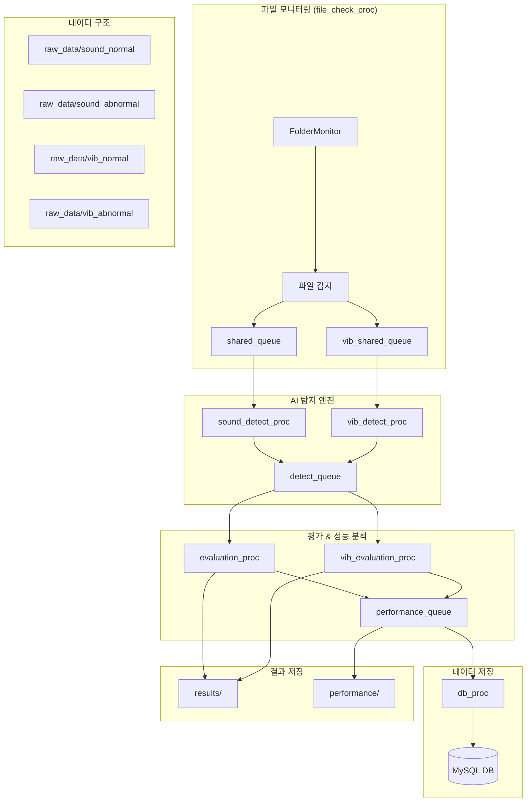

## 대구 제조 AI 프로젝트 학습 레포지토리

### 전체 시스템 프로세스 아키텍처

```mermaid
graph TB
    subgraph "파일 모니터링 (file_check_proc)"
        E[FolderMonitor]
        E --> F[파일 감지]
        F --> G[shared_queue]
        F --> H[vib_shared_queue]
    end

    subgraph "데이터 구조"
        A[raw_data/sound_normal] 
        B[raw_data/sound_abnormal]
        C[raw_data/vib_normal]
        D[raw_data/vib_abnormal]
    end
    
    subgraph "AI 탐지 엔진"
        I[sound_detect_proc]
        J[vib_detect_proc]
        G --> I
        H --> J
        I --> K[detect_queue]
        J --> K
    end
    
    subgraph "평가 & 성능 분석"
        L[evaluation_proc]
        M[vib_evaluation_proc]
        K --> L
        K --> M
        L --> N[performance_queue]
        M --> N
    end
    
    subgraph "데이터 저장"
        O[db_proc]
        P[(MySQL DB)]
        N --> O
        O --> P
    end
    
    subgraph "결과 저장"
        Q[results/]
        R[performance/]
        L --> Q
        M --> Q
        N --> R
    end
```

### 소리 모델

### 진동 모델

